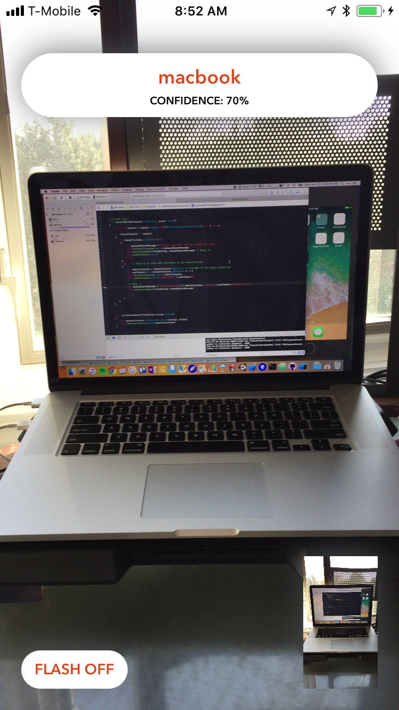

# DevSlopesProj-BotVision
iOS machine learning demo (using CoreML) where app tried to recognize everyday objects

The machine learning model used is from SqueezeNet. For better accuracy, using a bigger model would be better, but that would require some code to be rewritten.

This app uses the devices (back) camera, so this app cannot run in the Simulator; it can only run on a physical device. Because CoreML was introduced in iOS 11, you need that OS on your iDevice before testing.

